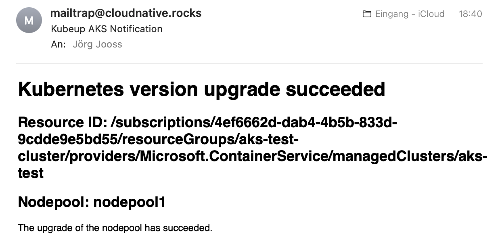
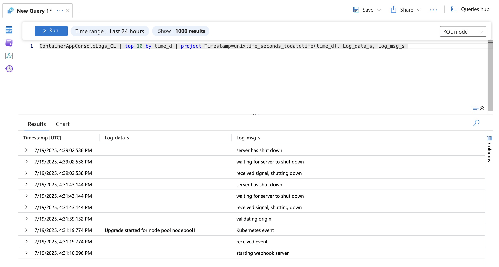

# Deployment
`kubeup` can be configured for different event delivery methods and security options.

Before deploying, choose your configuration options. For a quick start, follow the [quickstart guide](./quickstart.md) and return here for advanced configuration.

## Event delivery options
All delivery options can be combined. Event logging is enabled by default.

### Log to stderr
`kubeup` writes all events to stderr. With the provided Bicep templates, logs are forwarded to a Log Analytics workspace and stored in the `ContainerAppConsoleLogs_CL` table. On other platforms, use any log shipping solution.

### SMTP delivery
Send events as emails using SMTP. [Mailtrap](https://mailtrap.io) offers a free tier that works well with `kubeup`.



### Twilio SendGrid
Send events as emails using [Twilio SendGrid's email API](https://www.twilio.com/products/email-api). SendGrid no longer offers free plans.

## Authorization options
Authorization options are mutually exclusive. If both client secrets and Entra ID are configured, Entra ID takes precedence.

### No Authorization
No authorization is enforced, meaning anyone who knows your webhook endpoint can trigger it. This is useful for testing in development environments but **not recommended** for production.

### Client Secrets
Requires two secrets that can be used interchangeably. This enables seamless key rotation by replacing one key at a time without service disruption. The sender must include one key as a query parameter when calling the webhook.

### Entra ID Authorization
Validates that the sender has a valid Entra ID access token with the correct role claim. This is the **recommended** and most secure authorization method.

**Note:** Setting up Entra ID authorization requires specific Entra ID privileges often not granted to end users or developers. [See below](#deploy-with-entra-id-authorization) for details.

## Prerequisites
To deploy `kubeup` to Microsoft Azure:

1. **Azure subscription** - Sign up [for free](https://azure.microsoft.com/free/)
2. **Bash environment** - Available on macOS/Linux. On Windows 10/11, install [Windows Subsystem for Linux](https://docs.microsoft.com/windows/wsl/install)
3. **[Task](https://taskfile.dev)** - For running build and deployment steps
4. **[Azure CLI](https://docs.microsoft.com/cli/azure/install-azure-cli)** - For deploying Bicep templates
5. **[Bicep CLI](https://learn.microsoft.com/azure/azure-resource-manager/bicep/install#azure-cli)** - Install with `az bicep install`
6. **Email service** (optional) - [Twilio SendGrid account](https://sendgrid.com/pricing/) or SMTP access for email notifications
7. **[Microsoft Graph CLI](https://github.com/microsoftgraph/msgraph-cli)** (optional) - Required only for Entra ID authorization

**Note:** The Microsoft Graph CLI was deprecated in July 2024 but remains functional for our needs. For PowerShell users, refer to [this Azure Event Grid script](https://learn.microsoft.com/azure/event-grid/scripts/powershell-webhook-secure-delivery-microsoft-entra-app#sample-script---stable).

Alternatively, use [Azure Cloud Shell](https://shell.azure.com), which has all required tools except Microsoft Graph CLI. Follow the [Linux installation steps](https://learn.microsoft.com/graph/cli/installation?tabs=linux) to install `mgc` in Cloud Shell.

## Deployment steps

### Create an AKS cluster (optional)
If you don't have an AKS cluster, create one using the included script. Adjust the names and region as needed:

```bash
# Set variables in .env file first
cp .env.template .env
# Edit .env with your cluster details
task deploy:aks
```

### Prepare the `.env` file
Copy the template and configure for your deployment:

```bash
cp .env.template .env
```

See the [configuration guide](./configuration.md) for required settings, then continue with deployment.

### Deploy kubeup
Deploy `kubeup` using the included Bicep templates. This creates both the Azure Container App and Event Grid subscription for your AKS cluster events.

#### Deploy with client secrets or no authorization
```bash
task deploy:azure
```

#### Deploy with Entra ID authorization
Requires `Application Developer` role or higher in Entra ID, unless your tenant allows all users to register applications.

Sign in to Microsoft Graph CLI:
```bash
tenant_id="Your Entra ID tenant ID"
mgc login --tenant-id $tenant_id --scopes "Application.ReadWrite.All User.Read"
```

**Note:** `Application.ReadWrite.All` requires administrator consent. Ask an Entra ID administrator to grant this scope for your user or the entire tenant.

Deploy everything:
```bash
task deploy:all
```

#### Deploy only Entra ID components
Creates required Entra ID objects and role assignments. Same prerequisites as above apply.

```bash
task deploy:entraid
```### Verification 
After `kubeup` has been deployed, it may take some time before you will receive notifications, depending on when new Kubernetes version become available or when you upgrade your cluster to a newer Kubernetes version. 

If you want to test `kubeup` right away, trigger a Kubernetes update to the latest version offered by AKS and check the logs. 

```bash
version=$(az aks get-upgrades -n $KU_AKS_CLUSTER -g $KU_AKS_RESOURCE_GROUP \
  --query 'controlPlaneProfile.upgrades[].kubernetesVersion' -o tsv | sort | head -1)
az aks upgrade -n $KU_AKS_CLUSTER -g $KU_AKS_RESOURCE_GROUP -k $version -y
```

Once Kubernetes events are published for your AKS cluster, you will receive emails (if configured) and log entries in your Log Analytics workspace's `ContainerAppConsoleLogs_CL` table.

