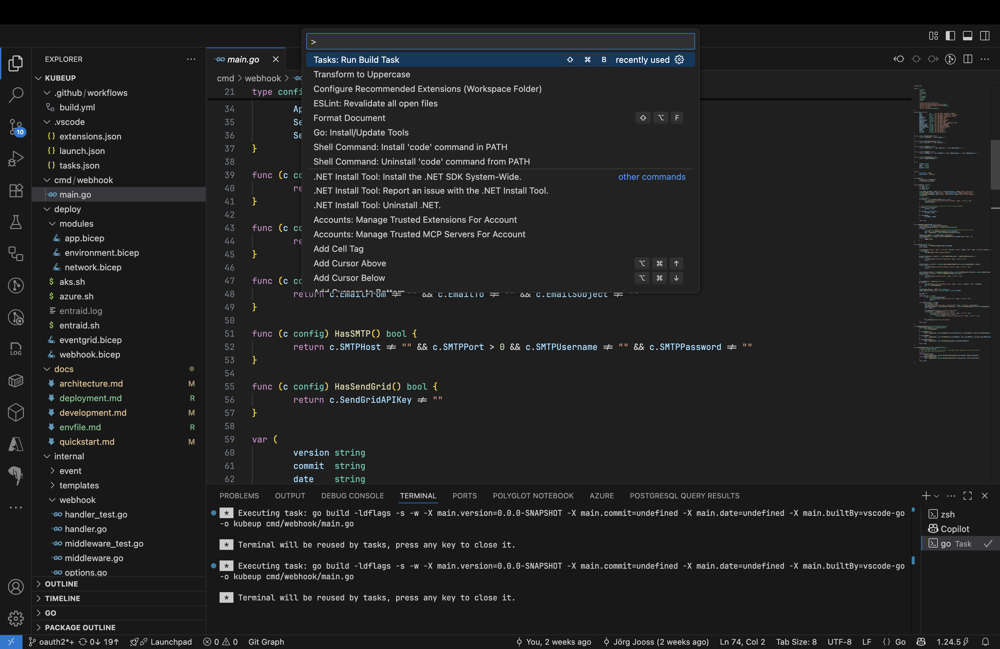
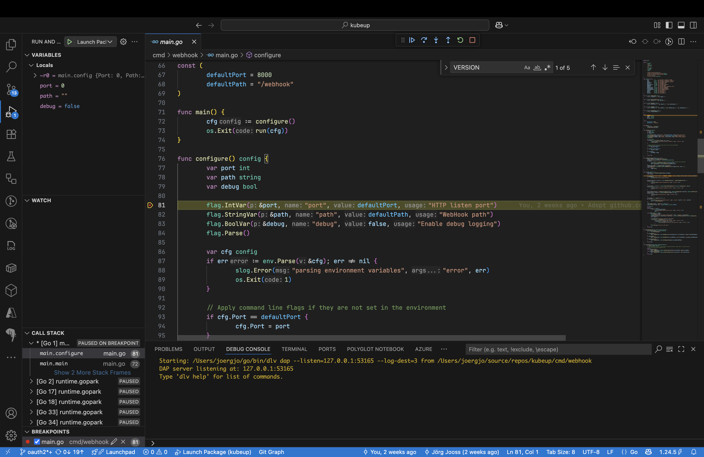
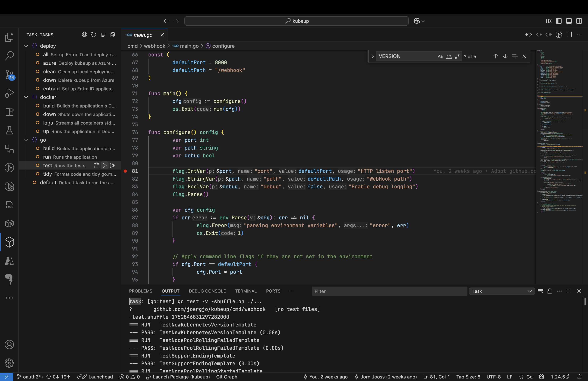
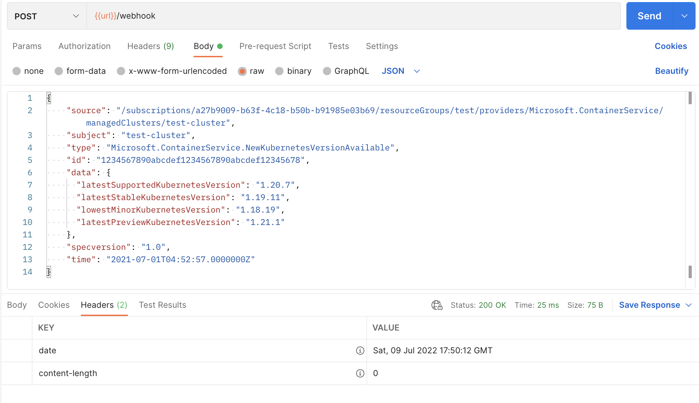

# Development

The included Taskfiles contain task definitions to build, test, run, and deploy `kubeup` without requiring knowledge of Go, Docker, or Azure CLI toolchains. You can also use Visual Studio Code to build and debug `kubeup`.

## Prerequisites
1. **[Go](https://go.dev/dl/) 1.24 or later** - Go toolchain and standard library
2. **[Task](https://taskfile.dev)** - Build and deployment automation
3. **[Azure CLI](https://docs.microsoft.com/cli/azure/install-azure-cli)** - Deploy Bicep templates to Azure
4. **[Bicep CLI](https://learn.microsoft.com/azure/azure-resource-manager/bicep/install#azure-cli)** - Install with `az bicep install`
5. **[Visual Studio Code](https://code.visualstudio.com/)** (optional) - Configured IDE with debugging support

## Terminal-based development
Use the included Taskfiles to test, build, run, and deploy without knowing the underlying toolchains.

### Run kubeup
Compiles, runs, and cleans up the binary. Settings from local `.env` files are applied automatically.

```bash
task go:run
# or simply
task
```

### Run tests
Executes all Go tests:

```bash
task go:test
```

### Build executable
Compiles source code to a platform-specific executable:

```bash
task go:build
```

### Format and tidy
Formats code per Go standards and cleans up dependencies:

```bash
task go:tidy
```

### Build container image
Builds a container image from current source code and caches it locally (not pushed to registry).

Override image name/tag with `IMAGE` and `TAG` environment variables or in your `.env` file. Defaults to `kubeup:dev`.

```bash
task docker:build
```

### Run container image
Requires `task docker:build` first. Runs container and exposes webhook on host port 8000.

```bash 
task docker:up
```

### Stream container logs
Requires `task docker:up` first. Streams running container logs to terminal.

```bash
task docker:logs 
```

### Stop container
Shuts down the running container.

```bash
task docker:down 
```

## Visual Studio Code development
Open the project folder in VS Code. It will prompt to install recommended extensions if not already installed.

### Building
Execute **Run Build Task** (Cmd+Shift+B / Ctrl+Shift+B).



### Debugging
Execute **Debug: Start Debugging** (F5). Requires a valid `.env` file in the project root. See [deployment instructions](deployment.md) to create one.



### Running Task tasks
With the [Task extension](https://marketplace.visualstudio.com/items?itemName=task.vscode-task) installed, run tasks directly from the Task sidebar.



## Manual testing
Test `kubeup` using the included [sample requests](../testdata/) and any HTTP client like curl, httpie, wget, or Postman. Send sample requests to the webhook endpoint via HTTP POST.



## Customizing task definitions
To add or modify task definitions, create `Taskfile.yaml` in the project root and adapt content from `Taskfile.dist.yaml`. This personal task file [takes precedence](https://taskfile.dev/usage/) and is ignored by Git.  
