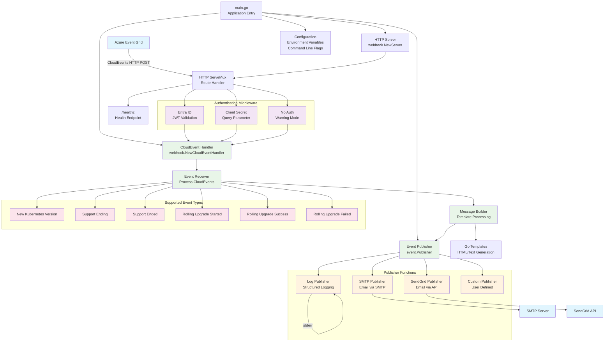

# Implementation

## Technology stack
`kubeup` is written in [Go](https://go.dev) and consumes [CloudEvents](https://cloudevents.io) received from [Azure Event Grid](https://learn.microsoft.com/en-us/azure/event-grid/overview). 

## Software Architecture Diagram

## The `kubeup` webhook 
### Authorization
`kubeup` supports all webhook authorization options that work with Azure Event Grid:

- **No authorization**: Anyone who knows your webhook endpoint can call it. *Not recommended* except for development testing
- **[Client secret as query parameter](https://learn.microsoft.com/en-us/azure/event-grid/security-authentication#using-client-secret-as-a-query-parameter)**: Requires two secrets (keys) that can be used interchangeably for rolling secret updates. The sender must provide one key via the `access_token` query parameter
- **[Entra ID authorization](https://learn.microsoft.com/en-us/azure/event-grid/secure-webhook-delivery#deliver-events-to-a-webhook-in-the-same-microsoft-entra-tenant)** (recommended): Verifies the sender has a valid Entra ID access token with the correct `role` claim

Authorization is implemented using idiomatic HTTP middleware.

### CloudEvents
CloudEvent processing uses the [CloudEvents SDK](https://github.com/cloudevents/sdk-go). `kubeup` follows the pattern from [this sample](https://github.com/cloudevents/sdk-go/blob/main/samples/http/receiver-direct/main.go)—the SDK provides an [http.Handler](https://pkg.go.dev/net/http#Handler) while leaving the application in control of the HTTP server and mux.

This approach allows plugging CloudEvents processing logic into any idiomatic Go HTTP mux like `net/http`, `gorilla/mux`, or `go-chi`. 

### HTTP
The core HTTP server and request handling implementation uses `net/http` from the [Go standard library](https://pkg.go.dev/net/http). Since `kubeup` only handles two paths (webhook callback and health probe), no advanced mux is needed.

### Logging
Structured logging is provided by Uber's [zap](https://github.com/uber-go/zap), ensuring log format alignment with the CloudEvents SDK logs. `kubeup` wraps zap with Go's [structured logging package](https://pkg.go.dev/log/slog) rather than using zap directly.

### Email
`kubeup` uses [Gomail](https://github.com/go-mail/mail) for SMTP email delivery and the [SendGrid Go SDK](https://github.com/sendgrid/sendgrid-go) for SendGrid API email delivery.

### JWT Bearer Token Validation
JWT bearer tokens are validated using Auth0's [go-jwt-middleware](https://github.com/auth0/go-jwt-middleware/v2). Beyond standard checks (valid audience, unexpired tokens), `kubeup` requires a `role` claim with the value `AzureEventGridSecureWebhookSubscriber`.

## CloudEvent handling
Events received by `kubeup` are handled by a `Publisher` struct that holds a slice of `PublisherFunc` functions. `kubeup` provides various `PublisherFunc` implementations:

- **Structured logging**: Write to stderr using structured logging
- **SMTP email**: Send email using SMTP servers  
- **SendGrid email**: Send email using the [Twilio SendGrid](https://sendgrid.com) API
- **Custom functions**: Provide your own `PublisherFunc` implementation

## Networking 
Since Azure Event Grid doesn't support private endpoints for system topics, you must either run `kubeup` with a public endpoint or use a reverse proxy service like [ngrok](https://ngrok.com) to route events to your endpoint. 
